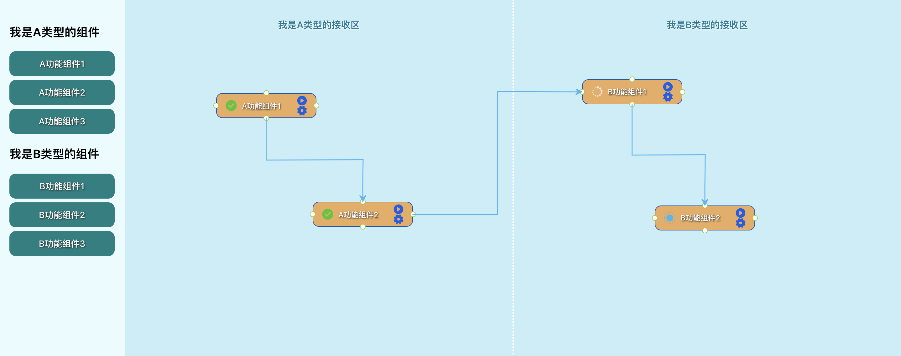

<!--
 * @Description: 
 * @Version: 
 * @Author: Yanzengyong
 * @Date: 2020-09-04 22:55:05
 * @LastEditors: Yanzengyong
 * @LastEditTime: 2020-09-14 18:01:53
-->
# 一个基于jsplumb和react-dnd实现的拖拽例子

> 目前就是一个很简单的例子，后期会优化，会考虑做成组件或者项目分享

### 当前已有功能

- [x] 分区拖拽
- [x] 点击执行进行状态更改
- [x] 连线hover删除
- [x] 不可连接自己
- [x] 记住节点及关系

## 截图

